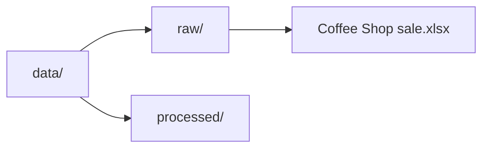
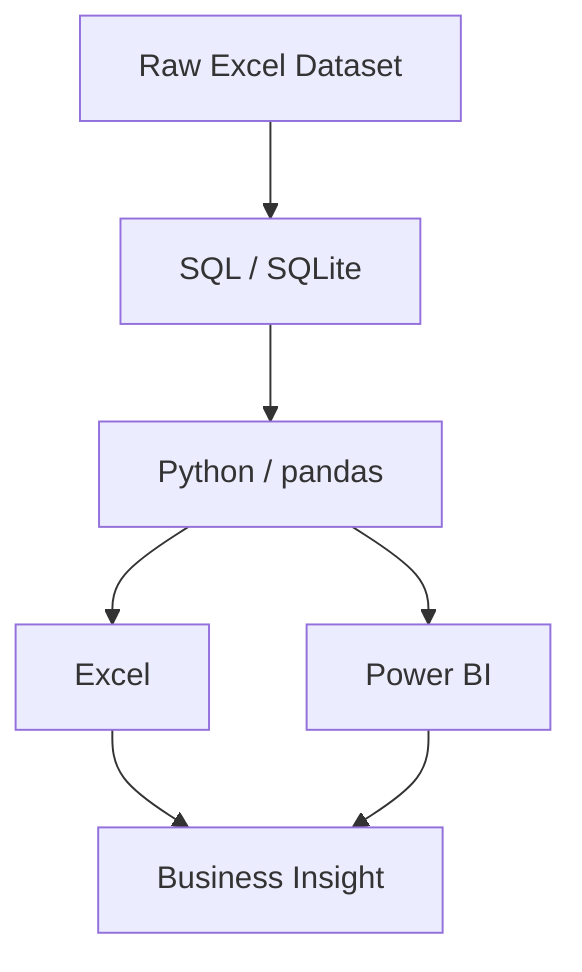

# Retail Sales Analysis

### Project Overview

This project analyses sales transaction data from a fictional coffee shop business operating across three store locations.

The aim is to investigate product performance, daily sales trends and differences in sales performance between stores. 

SQL, Python (pandas), Excel and Power BI will be used throughout the project to explore, process, analyse and visualise the data, demonstrating how these tools can work together in a data analysis workflow.

The final goal is to develop an interactive dashboard and present key findings that could help the business better understand its sales performance.

### Core Analysis

| Analysis Area | Business Question |
| --- | --- |
| Product Performance | Which products generate the highest and lowest sales revenue, and how does their performance change during the reporting period? |
| Sales Trends | Which days generate the highest and lowest sales revenue, and are there recurring patterns in daily sales? |
| Store Performance | How does sales performance vary between stores and geographical locations? |

### Future Extensions

| Analysis Area | Business Question | 
| --- | --- |
| Operating Costs | How do monthly operating costs compare with sales revenue, and how does the relationship change throughout the year? |
| Staffing Efficiency | How many hours are worked by staff relative to sales revenue, and how does this vary across stores and time periods? |

## Dataset

**Name:** Coffee Shop Sales  
**Source:** Maven Analytics  
**Business:** Maven Roasters (fictional)  
**Reporting period:** January–June 2023  
**License:** Public Domain  
**Original format:** Excel (.xlsx)

## Tools and Technologies

This project displays use of these tools:

## Project Status

In progress - Initial project setup and dataset preparation. SQL analysis, Python exploration, Excel reporting and Power BI dashboard development will be completed in subsequent stages 